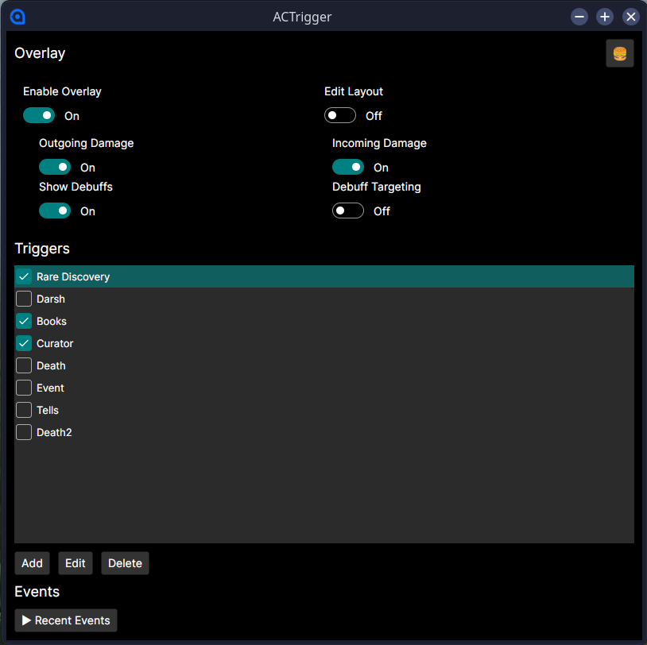
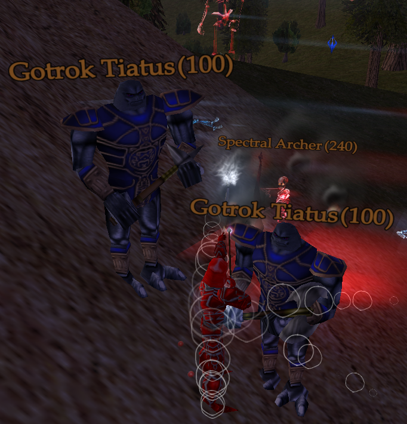
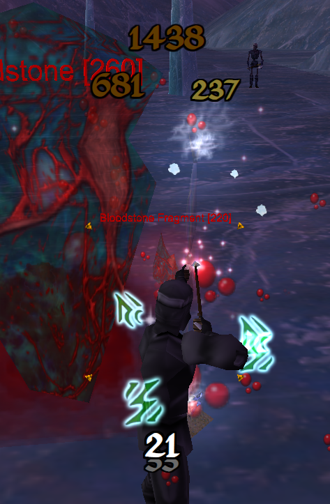
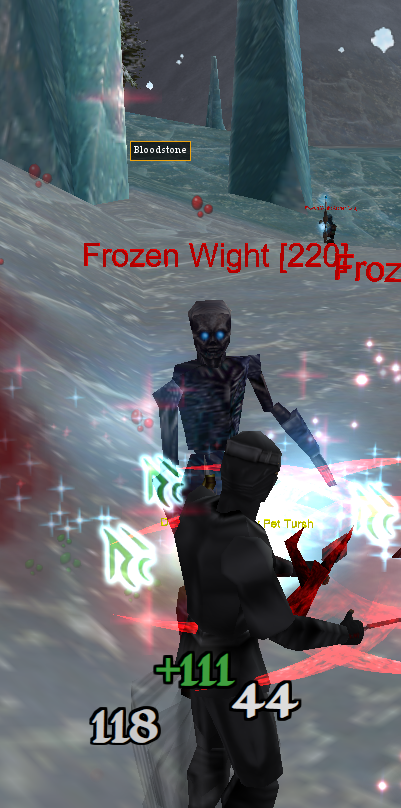
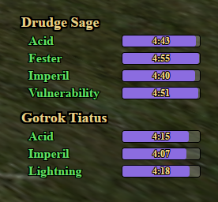
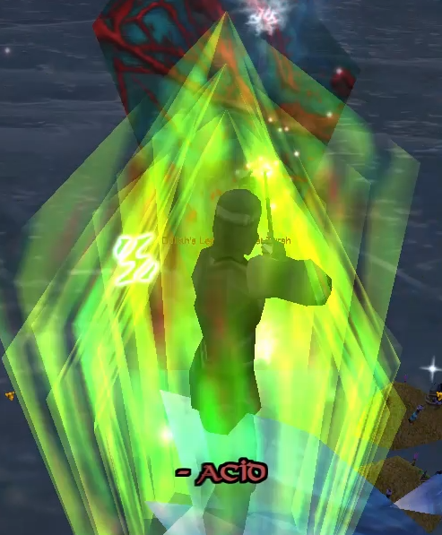

# ACTrigger

> **Important:** ACTrigger is **not an in-game Decal plugin interface**. It is a standalone desktop application that works **alongside** a lightweight Decal plugin. The plugin captures real-time game events and communicates them to the external ACTrigger application, while the application can also communicate back to the plugin when needed. This architecture enables modern overlays, sound alerts, and configuration outside of the game client. As such, it does not work in exclusive fullscreen.

ACTrigger is a real-time trigger and combat overlay for **Asheron's Call** that combines a Decal plugin with a modern Avalonia UI. It provides configurable sound triggers, scrolling combat text, incoming damage notifications, and a debuff overlay that tracks the effects you apply to your current target.

Designed to work alongside Decal rather than replace it, ACTrigger focuses on providing information that's easy to see during combat while remaining lightweight and highly configurable.

---

# Features

- **Real-time sound triggers** using regular expressions.
- **Incoming and outgoing scrolling combat text.**
- **Debuff tracking** for your target.
- **Click-to-target debuff overlay** for quickly reselecting previously affected monsters.
- Configurable overlay positions.
- Windows and Linux support through **Avalonia UI**.
- Lightweight Decal plugin for real-time combat event capture.

---

# Main Interface

The main application allows you to configure triggers, choose sounds, manage overlays, and adjust application settings.

---

# HUD Nameplates

ACTrigger can display customizable in-game HUD nameplates above players, monsters, NPCs, vendors, portals, and pets. Nameplates include useful information such as player levels and monarch tags while using intelligent caching to minimize performance impact.

HUDs are generated automatically as new objects are encountered and can be customized with different fonts to better match your preferred interface.

---

# Combat Overlays

## Outgoing Damage

Outgoing damage is displayed as animated floating combat text near your character, making it easy to monitor damage without watching the chat window.

---

## Incoming Damage

Incoming damage and healing is displayed separately to distinguish immediately from your own attacks.

---

## Debuff Tracking

When you successfully cast a tracked debuff on a monster, ACTrigger records it and displays the remaining duration in a dedicated overlay.

Debuffs are grouped by monster, making it easy to monitor multiple targets during combat.

Each monster entry is also **clickable**. Clicking a tracked monster in the debuff overlay sends a command to the Decal plugin, allowing you to quickly reselect that monster in-game without searching for it manually.

---

## Incoming Debuff Notifications

When enemies apply tracked effects to you, ACTrigger displays a notification so important debuffs are immediately visible.

---

# How It Works

ACTrigger consists of two components:

## ACTrigger.Decal

The Decal plugin runs inside the Asheron's Call client and listens for game events including:

- Combat messages
- Spell casts
- Debuff applications
- Loot events
- Session changes
- Portal transitions

These events are written to a lightweight log that serves as the communication bridge between the game client and the user interface.

---

## ACTrigger.UI

The standalone Avalonia application watches the log generated by the Decal plugin in real time.

As new events arrive it:

- Plays configured sounds
- Displays combat text
- Tracks active debuffs
- Updates overlay windows
- Allows configuration without restarting the game

Because the UI is separate from the plugin, it remains responsive while keeping the in-game plugin extremely lightweight.

---

# Installation

## 1. Install the Decal Plugin

- Copy the **ACTrigger.Decal** folder into your Decal plugins directory.
- Launch **Decal**.
- Click **Add** → **Browse**.
- Select **ACTrigger.Decal.dll**.
- Close the Add dialog and click **Update**.

## 2. Configure ACTrigger

- Run **ACTrigger.UI.exe**.
- Open the menu in the upper-right corner and select **Settings**.
- Browse to your **ACTrigger.Decal** folder.
- Verify the application reports that the plugin was found.
- Click **Done**.

## 3. Launch

- Start Asheron's Call through Decal with the ACTrigger plugin enabled.
- Launch **ACTrigger.UI.exe** if it is not already running.

The first time you run ACTrigger, position the overlay windows where you prefer and configure any custom triggers.

---

# Building

ACTrigger is built using:

- .NET 9
- Avalonia UI
- Decal SDK (.NET Framework 4.8)

The repository contains both the standalone UI application and the Decal plugin source.

---

# Current Limitations

- Debuff tracking is currently limited to effects detected through the available Decal interfaces.
- Certain Void Magic debuffs cannot be tracked because the game client does not expose sufficient information.
- Fellowship-wide debuff tracking is planned but not currently implemented.

---

# Version

Current release: **v0.9.0**

This is the first public release. Additional features, improvements, and quality-of-life enhancements are planned as the project continues to evolve.

---

# License

See the repository for license information.
